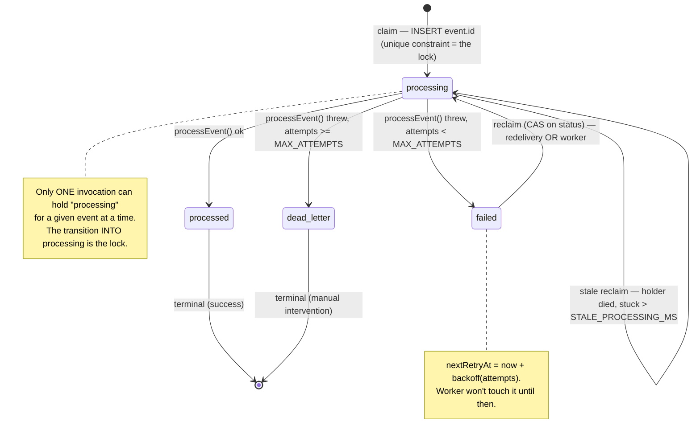

# Engineering Notes

A record of the architecture, the problems hit while building and deploying, and how each was resolved. The goal is to show the reasoning, not just the final result.

If you only read one section, read the next one — it's where the real engineering lives.

---

## 0. The webhook engine — the hard decisions

The webhook pipeline looks, at a glance, like "save the event, do the thing, and run a cron job to mop up." That framing undersells it. What's actually implemented is a small, durable **state machine with an atomic claim protocol**, designed to survive the failure modes that make billing webhooks notoriously hard to get right: duplicate deliveries, concurrent deliveries, partial failures, process death mid-work, and a payment provider that retries the same event for days. This section walks through each decision and — just as important — what would break without it.

### 0.1 The event state machine

Every Stripe event becomes a `WebhookEvent` row whose `status` moves through a deliberately small set of states. The whole design is an effort to make every transition either **atomic** or **idempotent**, so that no crash, race, or redelivery can leave a paying user in the wrong billing state.



Plain-text version (same thing, for environments that don't render Mermaid):

```
                 INSERT event.id (status=processing)
   [ Stripe ] ─────────────────────────────────────────►( processing )
                 unique constraint is the lock                │
                                                              │ processEvent()
                          ┌───────────────────────────────────┼───────────────────────────┐
                          │ ok                                 │ threw                      │ threw
                          ▼                                    ▼ (attempts < MAX)           ▼ (attempts >= MAX)
                    ( processed )                          ( failed )                ( dead_letter )
                      terminal                                 │                         terminal
                      success                                  │ nextRetryAt = now+backoff   (manual fix)
                                                               │
                                       reclaim (CAS on status):│
                                       redelivery OR cron worker│
                                                               ▼
                                                        ( processing )  ◄── stale reclaim if a
                                                                            holder died (> STALE_PROCESSING_MS)
```

Four states, and the discipline is that you can only *enter* `processing` by winning an atomic write. Everything else follows from that.

### 0.2 Why the atomic claim is the whole ballgame

The single most important line in the system is the `INSERT` of `event.id`:

```ts
await prisma.webhookEvent.create({
  data: { id: event.id, status: WebhookStatus.processing, payload: body, attempts: 1 },
});
```

`event.id` is the primary key. The **unique constraint is the lock.** Two deliveries of the same event — and Stripe *will* deliver the same event more than once, by design — race to insert the same primary key. Exactly one wins; the loser gets `P2002` (unique violation) and bails out as a duplicate. There is no window between "check if it exists" and "act on it," because the check *is* the act. It's a compare-and-swap implemented by the database's strongest guarantee.

The redelivery/retry path uses the same idea, expressed as a conditional `updateMany`:

```ts
const reclaimed = await prisma.webhookEvent.updateMany({
  where: { id: event.id, status: existing.status }, // CAS: only if status is still what I observed
  data:  { status: WebhookStatus.processing, attempts: { increment: 1 } },
});
if (reclaimed.count === 0) { /* someone else reclaimed it first → treat as duplicate */ }
```

The `where` clause pins the status I *observed a moment ago*. If anyone else (a concurrent redelivery, or the cron worker) moved that row between my read and my write, my update matches zero rows and I back off. This is optimistic concurrency control — no `SELECT ... FOR UPDATE`, no advisory lock, no Redis. The row's own status column is the lock token.

**What breaks without it.** Suppose you replaced the claim with the naïve `findUnique` → `if (!exists) process()` pattern. Stripe sends an event; your serverless platform, under a burst, spins up two concurrent invocations for two redeliveries of *the same* event. Both call `findUnique`, both see "not processed," both call `processEvent`. Now `syncSubscription` runs twice concurrently. Best case, the second write is a harmless no-op. Worst case, they interleave — two `Customer` creations, a subscription written then half-overwritten, an upgrade applied twice. In billing, "process exactly once" isn't a nicety; double-processing is how a customer gets double-charged or a cancellation gets resurrected. The atomic claim turns "exactly once" from a hope into an invariant enforced by the database.

### 0.3 Why idempotency is mandatory here (not optional)

Stripe's delivery contract is **at-least-once**, not exactly-once. The [docs are explicit](https://stripe.com/docs/webhooks): you may receive the same event multiple times, and you must be prepared for it. Reasons range from network blips (Stripe sent it, your `2xx` got lost, Stripe retries) to Stripe's own internal retries to manual replays from the dashboard.

So idempotency isn't a defensive flourish — it's the price of admission. This system gets it on two levels:

1. **Delivery-level idempotency** via the claim. The same `event.id` can arrive ten times; only the first insert wins, the rest short-circuit. The DB key *is* the dedupe key.
2. **Effect-level idempotency** in `processEvent`. Even setting the claim aside, the business effect is a *reconciliation*, not an *increment*. `syncSubscription` reads the current subscription state from Stripe and writes the resulting truth, keyed by `stripeSubscriptionId` (a unique upsert target). Running it twice with the same input converges to the same row. There's no `balance += amount` anywhere that would corrupt under replay.

The two layers are belt-and-suspenders on purpose: the claim prevents *concurrent* double-processing, and the reconciliation shape makes *sequential* reprocessing (a failed event retried later) safe. You need both, because the retry path deliberately re-runs `processEvent` on events that previously failed.

### 0.4 Why dead-letter instead of infinite retry

Failures come in two flavors, and conflating them is a classic outage amplifier:

- **Transient** — a timeout, a pool exhaustion, a brief Stripe blip. Retrying later fixes it.
- **Deterministic** — a malformed payload, an unmapped enum, a bug in `processEvent`. Retrying *never* fixes it; it just burns the same error forever.

Retrying a deterministic failure on every redelivery is a tight failure loop: Stripe redelivers for ~3 days, your worker re-attempts on every cron tick, and each attempt does the same expensive cross-region work only to throw the same error — while burying the signal of *real* transient failures under the noise. `decideFailureOutcome` draws the line: under `MAX_ATTEMPTS` (8), schedule a backed-off retry; at the ceiling, move to `dead_letter` (terminal) and stop. `dead_letter` is a deliberate "a human needs to look at this" state, surfaced by the health endpoint, rather than a silent infinite spin. The cost of being wrong about "transient vs deterministic" is bounded to 8 attempts with exponential backoff, not unbounded.

### 0.5 Two lines of defense, in order

The retry story has a specific ordering that's easy to miss:

1. **Stripe is the first line of defense.** When the handler returns a `500`, Stripe redelivers — with its own backoff — for up to ~3 days. For the overwhelming majority of transient failures, *Stripe's* redelivery resolves the event before your worker ever touches it. The handler returning `500` on failure isn't an error path bolted on; it's actively recruiting Stripe's retry infrastructure as the primary recovery mechanism.
2. **The cron worker is the last resort.** It exists for the events that fall through: ones where Stripe eventually gave up, or where the failure outlived the redelivery window, or a `processing` row whose holder died mid-flight (the serverless function was killed). The worker scans for `failed` rows past their `nextRetryAt` and stale `processing` rows, reclaims them with the same atomic CAS, and re-runs the identical `processEvent`. It's not doing different work — it's the same engine, triggered by a different clock.

This ordering is *why* a once-daily cron on the free tier is defensible (see §4): Stripe is already covering the first hours of retries. The worker only has to catch the long tail.

One precision worth stating, because it's easy to misread the code: the `nextRetryAt` backoff computed by `computeBackoffMs` is the **worker's** clock, not the handler's. When Stripe redelivers a `failed` event to the synchronous handler, the handler reclaims and reprocesses it immediately — it does *not* consult `nextRetryAt`. That's deliberate and correct: Stripe already applies its own backoff to redeliveries, so on the synchronous path we defer to Stripe's schedule. `nextRetryAt` exists to pace the *worker's* candidate scan, which is the only consumer of the backoff window. The two clocks don't conflict; they govern two different paths.

### 0.6 Surviving process death (the stale reclaim)

Serverless functions get killed — cold-start budget exceeded, `maxDuration` hit, platform eviction. If an invocation dies *after* claiming an event (status = `processing`) but *before* finishing, that row would be stuck forever in `processing`, never picked up again, because the claim succeeded. That's a silent stuck event — the worst kind, because nothing errors.

The defense is `STALE_PROCESSING_MS`. A `processing` row whose `updatedAt` is older than the staleness window is treated as abandoned and is eligible for reclaim — by the handler (on a later redelivery) or by the worker. The reclaim is the same atomic CAS, so if the original holder somehow wasn't dead and finishes, only one of them wins the terminal write. The loop deadline in the worker (`LOOP_DEADLINE_MS` < `maxDuration`) is the complementary half: the worker stops *taking new work* before the platform can kill it mid-event, minimizing how often events get orphaned in the first place.

### 0.7 Single source of policy

Both entry points — the synchronous handler and the asynchronous worker — import the *same* `retry-policy.ts` (`computeBackoffMs`, `decideFailureOutcome`, `MAX_ATTEMPTS`, `STALE_PROCESSING_MS`) and the *same* `webhook-processor.ts` (`processEvent`). There is exactly one definition of "how long to back off," "when to dead-letter," and "what an event actually does." A change to the policy can't make the two paths drift apart, because there's only one path's worth of logic. This is the difference between two code paths that *happen* to agree today and one shared contract that *must* agree.

---

## 1. Architecture overview

A subscription SaaS on a single Next.js 15 (App Router) codebase — frontend and backend in one deploy.

```
Browser
  │
  ├─ NextAuth (Auth.js v5) ── GitHub OAuth ── session
  │
  ├─ /pricing ── CheckoutButton ──► POST /api/stripe/checkout ──► Stripe Checkout
  │                                                                   │
  │                                              (user pays on Stripe-hosted page)
  │                                                                   │
  └─ /dashboard ◄── getActiveSubscription() ◄── Postgres ◄───────────┘
                                                    ▲
                                                    │
            Stripe ──► POST /api/stripe/webhook ────┤  (signature-verified, idempotent)
                                                    │
                       Vercel Cron ──► /api/cron/process-webhooks  (retry safety net)
```

**Stack:** Next.js 15 · Auth.js v5 · Prisma · PostgreSQL (Supabase) · Stripe · Tailwind · Vercel.

**Core design principle:** the source of truth for "is this user Pro?" is the database, written only by signature-verified Stripe webhooks. The success redirect (`/dashboard?checkout=success`) is treated as a UI hint, never as proof of payment.

### Why the webhook pipeline is the centerpiece

A checkout that "works" is easy. The hard part is making the billing state survive the messy reality of webhooks: duplicate deliveries, out-of-order events, transient failures, serverless cold-start kills, and Stripe's multi-day redelivery. The handler is built around that reality:

- **Claim-then-process idempotency.** The `event.id` is inserted into a `WebhookEvent` table *before* processing. The unique constraint is the lock — a duplicate delivery fails the insert (`P2002`) and exits early. The DB is the concurrency barrier, not an application-level check (which has a check-then-act race).
- **Bounded retries with backoff + jitter**, moving to `dead_letter` after a ceiling instead of looping forever on a deterministic failure.
- **A cron worker** as a second line of defense, reusing the same `processEvent` logic so both paths behave identically.
- **A health endpoint** exposing aggregate pipeline state for external monitoring.

---

## 2. Problems hit and how they were solved

Roughly in the order they happened.

### Setup & database

**Supabase connection string moved in the UI.** The docs pointed to `Settings → Database → Connection string`, but the current dashboard exposes strings behind the **Connect** button in the top bar. Used the **Transaction pooler** (port 6543) for `DATABASE_URL` and the **Direct connection** (5432) for `DIRECT_URL`.

**`P1013: empty host in database URL`.** The database password contained an `@`, which the URL parser read as the user/host separator, leaving an "empty host." Fixed by resetting the password to one without special characters (alternative would have been percent-encoding `@` as `%40`). Lesson baked into the README: prefer special-char-free DB passwords to avoid URL-encoding traps in every environment.

### Local dev

**Next.js silently installed 16.x instead of 15.x.** A stray `package-lock.json` in a parent directory (`C:\Users\Lucas\`) confused Next's workspace-root detection, and the install resolved a newer major. Next 16 renamed the `middleware.ts` convention to `proxy.ts`, so the existing middleware export wasn't recognized. Fixed by removing the stray lockfile and pinning back to the tested Next 15 line. Decision: stay on the version the project was written for rather than chase a major mid-build.

**Webhook test showed `Trigger succeeded` but nothing processed.** `stripe trigger` only confirms the event was created on Stripe's side. The first run was missing `--forward-to`, so events never reached localhost. Once forwarding was added, deliveries returned `[200]` — but `stripe trigger` uses synthetic fixtures (fake customer, no real `userId`), so it validates signature + idempotency, not the subscription↔user link. The real validation is a UI checkout with test card `4242…`.

### The subscription wasn't linking (timing race)

After a real checkout, the dashboard showed "no plan" — but a page refresh fixed it. The redirect to `/dashboard?checkout=success` rendered in the same instant the webhook was still writing the subscription. Confirmed via Prisma Studio that the row was correct (`status: active`, valid `currentPeriodEnd`). Not a bug — a timing gap between redirect and async webhook. This is exactly why the success redirect is never treated as proof of payment.

### Webhook 500s under load (the most instructive one)

A burst of events during checkout produced several `[500]` responses (20+ second durations). Investigation showed the cause in `lastError`: **`Timeout (9000ms) in processEvent`**. Two compounding factors, both environmental:

1. **Cross-region latency.** Supabase was provisioned in `us-east-2` (Ohio) while developing from Brazil; every Prisma query and `stripe.subscriptions.retrieve` crossed the continent.
2. **Concurrent burst + `connection_limit=1`.** The serverless-correct pool size means concurrent queries queue, stacking latency until the 9s processing timeout tripped.

The key insight: **the 500s were the system working as designed.** Failed events were marked `failed` with a `nextRetryAt`, and Stripe's redelivery (plus the subsequent `[200]`s) reconciled the final state correctly. The timeout-then-retry behavior absorbed the transient slowness. No code change — the right fix for production is co-locating the DB and the deploy region, not loosening the timeout.

### Deployment to Vercel

**Build failed: `Type '"2024-12-18.acacia"' is not assignable to type '"2025-02-24.acacia"'`.** The `^17.5.0` Stripe SDK resolved to a version expecting a newer pinned `apiVersion` than the code declared. Strict TypeScript in `next build` (which `next dev` tolerates) caught it. Fixed by aligning the `apiVersion` literal. Follow-up: this is the cost of `^` ranges — builds aren't reproducible. Recommended pinning exact versions for a portfolio project.

**Build blocked: "Vulnerable version of Next.js detected."** Vercel refuses to publish builds on Next versions with a known critical CVE (CVE-2025-66478, RSC RCE, CVSS 10.0). The build compiled fine; Vercel blocked it on policy. Upgraded to the patched line (`15.1.11`) and React to `19.0.3` — staying within the 15.1 line means no breaking changes, unlike jumping to 16. (The official advice to rotate secrets after patching was noted; low-risk here since it's test mode.)

**`EPERM: operation not permitted, rename query_engine-windows.dll.node` (local only).** Prisma's engine file was locked by a running process (`prisma studio` / `next dev`). Windows-only, irrelevant to the Linux build on Vercel. Fixed by closing the processes holding the file.

### Internationalization

The starter shipped in Portuguese. Translated all UI (5 pages + 2 components), the layout metadata, and `<html lang>`, plus switched the dashboard date from `toLocaleDateString("pt-BR")` to `en-US`. Escaped the apostrophe in JSX (`don&apos;t`) since a raw apostrophe breaks Next's strict lint.

### Tests

Added Vitest unit tests for the retry policy (backoff growth, 1h cap, jitter bounds, dead-letter threshold, clock-injected `nextRetryAt`). Two config snags along the way:

- `vite-tsconfig-paths` is ESM-only and broke the config loader; replaced it with a direct `@` alias in `vitest.config.ts`.
- `next build` type-checked `vitest.config.ts` and the `.test.ts` files (the `tsconfig` `include` globs all `.ts`), failing because test deps aren't part of the app. Fixed by adding `**/*.test.ts` and `vitest.config.ts` to `tsconfig` `exclude`.

---

## 3. Resilience decisions baked into the code

Documented to show the reasoning behind specific choices:

- **Stripe API version compatibility.** Recent Stripe versions moved `current_period_end` from the subscription to each item. Reading the old field returns `undefined` silently — which in billing means denying access to a paying user. `extractCurrentPeriodEnd` reads item-level with a top-level fallback. A precise note on the current state: against the *pinned* SDK (`stripe@17.7.0`, `apiVersion 2025-02-24.acacia`), `current_period_end` still lives at the top level and `SubscriptionItem` carries no such field, so today the function always takes the fallback branch. The item-level read is intentional forward-compatibility — it's dormant under Acacia and will activate automatically on a future Basil-era SDK bump, with no code change. Documenting it as dormant-by-design rather than currently-load-bearing keeps the prose honest about which branch executes.
- **Timeout that doesn't orphan its loser.** `withTimeout` races a real call against a timeout. When the timeout wins, the original promise is still pending and unobserved; a later rejection from it (e.g. a slow Stripe call that eventually errors *after* the timeout fired) would surface as an `unhandledRejection`. A no-op `.catch` is attached to the racing promise so the late rejection always has a handler — it doesn't change the outcome (already decided by the race), only prevents stray unhandled-rejection noise in the logs.
- **Stripe Customer creation race.** Two concurrent checkouts could create two Customers. An `idempotencyKey` derived from the `userId` makes Stripe return the same one.
- **Self-healing reconciliation.** `syncSubscription` reconciles by `stripeCustomerId`, falling back to a `userId` carried in metadata (set on both the checkout session and the subscription) and repairing the link if the first write failed.
- **Explicit status mapping.** An unknown Stripe status throws (entering the retry flow) rather than writing invalid data via `as any`.
- **Surface hardening.** A real-byte body-size cap on the public webhook endpoint; the cron worker is protected by `CRON_SECRET`.

---

## 4. Known trade-offs (free-tier constraints)

- **Inline processing instead of a true queue.** The maximally robust pattern returns `2xx` immediately and processes in a separate worker/queue. To stay 100% free with no extra infra, processing runs inline with a timeout and atomic claim, with the raw payload persisted so a worker can take over later. Conscious middle path.
- **Vercel Cron runs once/day on Hobby** (the schedule in `vercel.json` is honored at most daily regardless of the cron expression) and — critically — **does not retry a failed cron invocation**. If the single daily worker run errors out or is evicted, there is no second attempt until tomorrow. The design absorbs this in two ways: (a) the batch is large (`BATCH_SIZE = 50`) so one run drains the whole backlog in a pass, and (b) Stripe's own ~3-day redelivery (§0.5) covers the first hours, so a daily safety net is genuinely sufficient for the failure modes that survive Stripe. The honest limitation: on Hobby, the *worst-case* latency for an event that Stripe gave up on, before the worker reaches it, is up to ~24h. For a portfolio demo that's fine; for real billing it isn't.
  - **What changes on Pro:** the cron can run on a real sub-hourly schedule (`*/5 * * * *`), so shrink `BATCH_SIZE` and let frequency do the draining. A failed invocation still isn't auto-retried by Vercel Cron, but at 5-minute cadence the next tick *is* effectively the retry, so it stops mattering. Worst-case worker latency drops from ~24h to ~5min.
- **DB region.** Should be co-located with the deploy region in production. The cross-region setup used here is fine for a portfolio demo but is the root cause of the local timeout observations above.

---

## 5. What I'd do next (production hardening)

- **Move side-effect processing to a real queue and return `2xx` on persist.** The maximally robust pattern decouples *receiving* from *processing*: the handler verifies the signature, persists the raw event, enqueues a job, and returns `2xx` immediately — so Stripe is never waiting on `processEvent`, and a slow downstream dependency can't cause Stripe-visible failures. A durable queue (SQS, Cloud Tasks, QStash, or a Postgres-backed runner like River/Graphile Worker) becomes the retry engine, replacing the cron worker. The good news: the current schema already supports this transition almost for free. The raw `payload` is persisted and `processEvent` is a pure function of the event, so the queue worker is the *same* `processEvent` call triggered by a queue message instead of a cron tick. The state machine in §0 doesn't change; only what pulls events out of `failed`/`processing` does.
- **Run multiple worker instances safely — which the design already permits.** The atomic claim (§0.2) is precisely what makes horizontal scaling free of extra coordination. Today there's one cron invocation; with a queue you could have N concurrent workers competing for the same backlog. Because every worker must win the conditional `updateMany` (CAS on status) before doing work, two workers grabbing the same event is a non-event: one wins, the other's update matches zero rows and it moves on. No distributed lock, no leader election, no partitioning required — the per-row claim *is* the coordination. The one thing to add at higher concurrency is `SELECT ... FOR UPDATE SKIP LOCKED` (or the queue's own visibility-timeout semantics) on the candidate scan, so N workers don't all fetch the *same* batch of candidates and then mostly lose the CAS; that turns wasted CAS attempts into disjoint work assignment.
- **Co-locate Postgres with the Vercel region** to remove the cross-region latency that caused the timeout observations in §2.
- **Add an integration test for the claim-then-process path against a real test database** (the resilience test added in this pass covers the policy and the claim logic against a stubbed processor; an end-to-end test against Postgres would close the last gap).
- **Wire the health endpoint to an external monitor** with alerting on `dead_letter > 0` and on a stalled `oldestPendingAgeMs`.
- **Pin exact dependency versions** for reproducible builds (the `^` ranges caused two separate build breaks in §2).
