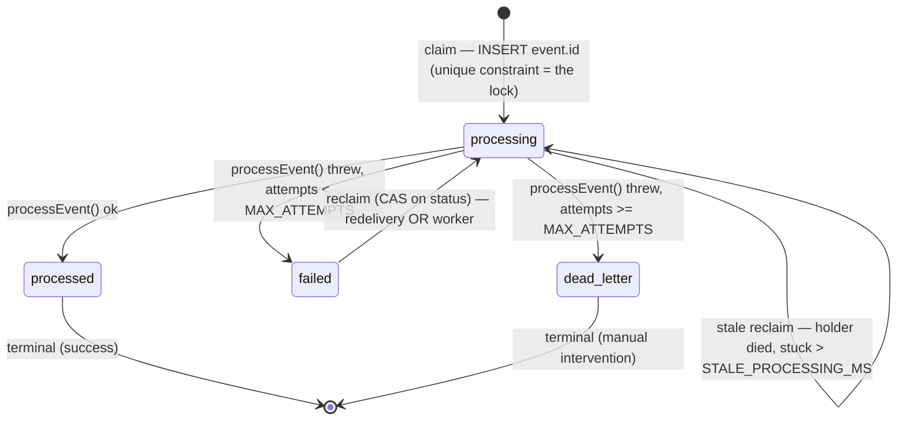

# SaaS Starter — Auth + Payments


A production-minded subscription platform built with **Next.js 15 (App Router)**, **Auth.js v5 (NextAuth)**, **Prisma**, **PostgreSQL (Supabase)**, and **Stripe**. It demonstrates the full SaaS loop: social login, subscription checkout, **concurrency-safe idempotent webhooks**, and a plan-gated dashboard.

> **Live demo:** https://saas-starter-ashy.vercel.app/
> Sign in with GitHub, then subscribe with Stripe test card `4242 4242 4242 4242` (any future expiry, any CVC).

---

## Why this project

Most payment integrations in a portfolio stop at "checkout works." This one focuses on the part that actually breaks in production: **the webhook pipeline**. It implements concurrency-safe idempotency, bounded retries with exponential backoff, a dead-letter path, an async reprocessing worker, and a health endpoint for alerting — all on **free tiers, with no extra infrastructure**.

> 📓 See [ENGINEERING_NOTES.md](./ENGINEERING_NOTES.md) for the full build journey — bugs hit, debugging, and the reasoning behind each decision.

---

## Resilience & failure handling

The webhook pipeline is the part of this project worth your attention. It's not "save the event and call a function" — it's a small **durable state machine with an atomic claim protocol**, built to survive the failure modes that make billing webhooks genuinely hard: duplicate deliveries, *concurrent* deliveries, partial failures, a serverless process dying mid-work, and a payment provider (Stripe) that redelivers the same event for ~3 days.

Every Stripe event becomes a `WebhookEvent` row that moves through four states. The design goal is that **every transition is either atomic or idempotent**, so no crash, race, or redelivery can leave a paying user in the wrong billing state:



What makes it robust, in one breath each:

- **The unique constraint is the lock.** The Stripe `event.id` is the primary key; claiming an event *is* the `INSERT`. Two concurrent redeliveries of the same event race to insert the same key — exactly one wins, the rest short-circuit as duplicates. There is no check-then-act window, because the check **is** the write. ([why this beats `findUnique → process`](./ENGINEERING_NOTES.md#02-why-the-atomic-claim-is-the-whole-ballgame))
- **Idempotent by contract, not by accident.** Stripe delivers at-least-once; the business effect is a *reconciliation* keyed by `stripeSubscriptionId`, not an increment — so replaying an event converges to the same row.
- **Bounded retries → dead-letter, never an infinite loop.** Exponential backoff with jitter for transient failures; after 8 attempts the event becomes `dead_letter` (terminal) so a deterministic bug can't burn the same error forever. Dead-letter is a deliberate "a human must look" state, surfaced by the health endpoint.
- **Two lines of defense, in order.** Stripe's own ~3-day redelivery is the *first* line; a Vercel Cron worker reusing the **same** `processEvent` is the last resort, catching events Stripe gave up on and `processing` rows whose holder died.
- **Survives process death.** A `processing` row left stale by a killed invocation is reclaimed via compare-and-swap; the worker also stops taking new work before its `maxDuration`, so it isn't killed mid-event.
- **One source of policy.** Handler and worker import the same `retry-policy.ts` and `processEvent` — the two paths *can't* drift, because there's only one definition of "back off," "dead-letter," and "what an event does."

It runs on **free tiers with zero extra infrastructure** — no Redis, no queue, no distributed lock. The database's own guarantees do the coordination.

**These guarantees are tested, not just claimed.** A resilience suite runs the real claim queries against a Postgres service container in CI on every push — proving that concurrent claims yield one winner, contended reclaims yield one winner, repeated failures terminate in `dead_letter`, and stale `processing` rows recover. (The badge above is green when they pass.)

→ **Full reasoning, with the "what breaks without it" walkthrough for each decision:** [ENGINEERING_NOTES.md §0 — The webhook engine](./ENGINEERING_NOTES.md#0-the-webhook-engine--the-hard-decisions)

---

## Tech stack

| Layer       | Tool                                   |
| ----------- | -------------------------------------- |
| Framework   | Next.js 15 (App Router) + TypeScript   |
| Auth        | Auth.js v5 (NextAuth) — GitHub OAuth   |
| ORM         | Prisma                                 |
| Database    | Supabase (PostgreSQL, free tier)       |
| Payments    | Stripe (test mode)                     |
| UI          | Tailwind CSS                           |
| Hosting     | Vercel                                 |

---

## Getting started

### Prerequisites
- Node.js 20+
- Free accounts on GitHub, Supabase, and Stripe
- Stripe CLI (for local webhook testing)

### 1. Install
```bash
npm install
```

### 2. Database (Supabase)
1. Create a project at https://supabase.com
2. Click the **Connect** button in the top bar of the project dashboard. From the modal:
   - **Transaction pooler** (port `6543`) → `DATABASE_URL`. Append `?pgbouncer=true&connection_limit=1` (essential in serverless).
   - **Direct connection** (port `5432`) → `DIRECT_URL` (used only for migrations).
3. Replace the `[YOUR-PASSWORD]` placeholder with your real database password (Settings → Database → Database password). Prefer a password without special characters to avoid URL-encoding issues.

### 3. Environment variables
Copy `.env.example` to `.env` and fill it in. Generate the auth secret with:
```bash
npx auth secret
```

### 4. Run migrations
```bash
npx prisma migrate dev --name init_auth_billing_webhooks
```

### 5. Stripe setup
- Create a **recurring** product in the Stripe Dashboard (Product catalog) and copy its **price ID** (`price_...`, not `prod_...`) into `STRIPE_PRICE_ID`.
- Copy your **test secret key** (`sk_test_...`) into `STRIPE_SECRET_KEY`.

### 6. Run locally
```bash
npm run dev
```

### 7. Test webhooks locally
In a separate terminal:
```bash
stripe listen --forward-to localhost:3000/api/stripe/webhook
```
The CLI prints a `whsec_...` → put it in `STRIPE_WEBHOOK_SECRET` and restart the dev server. Then sign in, subscribe with card `4242 4242 4242 4242`, and confirm each delivery returns `[200]`.

---

## Deploy to Vercel

1. Push to GitHub and import the repo on Vercel.
2. Add all environment variables. **Do not** set `CRON_SECRET` — Vercel provisions it automatically for the cron job.
3. After the first deploy, set `NEXT_PUBLIC_APP_URL` to the live URL and redeploy.
4. **GitHub OAuth (production):** create an OAuth App with callback URL `https://your-app.vercel.app/api/auth/callback/github`; set `AUTH_GITHUB_ID` / `AUTH_GITHUB_SECRET`.
5. **Stripe webhook (production):** add an endpoint at `https://your-app.vercel.app/api/stripe/webhook` listening to `checkout.session.completed`, `customer.subscription.created`, `customer.subscription.updated`, `customer.subscription.deleted`, `invoice.payment_failed`. Put the endpoint's signing secret in `STRIPE_WEBHOOK_SECRET`.

> **Serverless database note:** in production, `DATABASE_URL` must point to the Supabase pooler in transaction mode with `?pgbouncer=true&connection_limit=1`. Each serverless invocation is an ephemeral process; without the pooler and a tiny per-container pool, concurrency spikes (including a webhook retry storm) exhaust the connection limit and take down **every** route that touches the database.

---

## License

MIT
