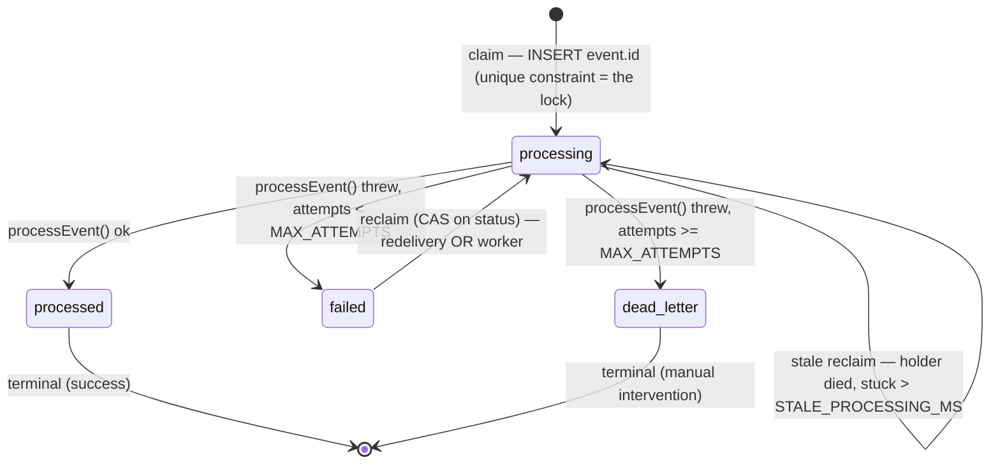

# SaaS Starter — Auth + Payments

A production-minded subscription platform built with **Next.js 15 (App Router)**, **Auth.js v5 (NextAuth)**, **Prisma**, **PostgreSQL (Supabase)**, and **Stripe**. It demonstrates the full SaaS loop: social login, subscription checkout, **concurrency-safe idempotent webhooks**, and a plan-gated dashboard.

> **Live demo:** https://saas-starter-ashy.vercel.app/
> Sign in with GitHub, then subscribe with Stripe test card `4242 4242 4242 4242` (any future expiry, any CVC).

---

## Why this project

Most payment integrations in a portfolio stop at "checkout works." This one focuses on the part that actually breaks in production: **the webhook pipeline**. It implements concurrency-safe idempotency, bounded retries with exponential backoff, a dead-letter path, an async reprocessing worker, and a health endpoint for alerting — all on **free tiers, with no extra infrastructure**.

> 📓 See [ENGINEERING_NOTES.md](./ENGINEERING_NOTES.md) for the full build journey — bugs hit, debugging, and the reasoning behind each decision.

---

## Resilience & failure handling

The webhook pipeline is the part of this project worth your attention. It's not "save the event and call a function" — it's a small **durable state machine with an atomic claim protocol**, built to survive the failure modes that make billing webhooks genuinely hard: duplicate deliveries, *concurrent* deliveries, partial failures, a serverless process dying mid-work, and a payment provider (Stripe) that redelivers the same event for ~3 days.

Every Stripe event becomes a `WebhookEvent` row that moves through four states. The design goal is that **every transition is either atomic or idempotent**, so no crash, race, or redelivery can leave a paying user in the wrong billing state:



What makes it robust, in one breath each:

- **The unique constraint is the lock.** The Stripe `event.id` is the primary key; claiming an event *is* the `INSERT`. Two concurrent redeliveries of the same event race to insert the same key — exactly one wins, the rest short-circuit as duplicates. There is no check-then-act window, because the check **is** the write. ([why this beats `findUnique → process`](./ENGINEERING_NOTES.md#02-why-the-atomic-claim-is-the-whole-ballgame))
- **Idempotent by contract, not by accident.** Stripe delivers at-least-once; the business effect is a *reconciliation* keyed by `stripeSubscriptionId`, not an increment — so replaying an event converges to the same row.
- **Bounded retries → dead-letter, never an infinite loop.** Exponential backoff with jitter for transient failures; after 8 attempts the event becomes `dead_letter` (terminal) so a deterministic bug can't burn the same error forever. Dead-letter is a deliberate "a human must look" state, surfaced by the health endpoint.
- **Two lines of defense, in order.** Stripe's own ~3-day redelivery is the *first* line; a Vercel Cron worker reusing the **same** `processEvent` is the last resort, catching events Stripe gave up on and `processing` rows whose holder died.
- **Survives process death.** A `processing` row left stale by a killed invocation is reclaimed via compare-and-swap; the worker also stops taking new work before its `maxDuration`, so it isn't killed mid-event.
- **One source of policy.** Handler and worker import the same `retry-policy.ts` and `processEvent` — the two paths *can't* drift, because there's only one definition of "back off," "dead-letter," and "what an event does."

It runs on **free tiers with zero extra infrastructure** — no Redis, no queue, no distributed lock. The database's own guarantees do the coordination.

→ **Full reasoning, with the "what breaks without it" walkthrough for each decision:** [ENGINEERING_NOTES.md §0 — The webhook engine](./ENGINEERING_NOTES.md#0-the-webhook-engine--the-hard-decisions)

---

## Tech stack

| Layer       | Tool                                   |
| ----------- | -------------------------------------- |
| Framework   | Next.js 15 (App Router) + TypeScript   |
| Auth        | Auth.js v5 (NextAuth) — GitHub OAuth   |
| ORM         | Prisma                                 |
| Database    | Supabase (PostgreSQL, free tier)       |
| Payments    | Stripe (test mode)                     |
| UI          | Tailwind CSS                           |
| Hosting     | Vercel                                 |

---

## Architecture highlights — detailed reference

The section above is the summary; this is the point-by-point detail, file by file.

### Production-grade webhook handler (`src/app/api/stripe/webhook/route.ts`)

This is the core of the project and where most implementations get it wrong.

1. **Signature verification on the raw body.** The body is read with `req.text()` **before** any parsing and validated via `stripe.webhooks.constructEvent`. Calling `req.json()` first would break verification in the App Router.

2. **Concurrency-safe idempotency (claim-then-process).** Instead of `findUnique → process → create` (which has a check-then-act race that concurrent Stripe redeliveries can exploit in a serverless environment), the `event.id` is **inserted first** into a `WebhookEvent` table with status `processing`. The database's **unique constraint becomes the lock**: if the insert fails with `P2002`, another invocation already claimed the event and this one returns `2xx` without reprocessing. The concurrency barrier is the database, not a late application-level check.

3. **Safe failure reprocessing.** A failed event is stored with status `failed`. On Stripe's redelivery, the handler reclaims it via an `updateMany` conditioned on the observed status (a compare-and-swap), preventing two concurrent retries from processing the same event simultaneously.

4. **Stuck-event recovery.** If an invocation dies (cold-start kill, OOM) after claiming but before finishing, the event would be stuck in `processing` forever. A staleness window lets a later retry reclaim it.

5. **Timeouts on every network call.** Both `subscriptions.retrieve` and the overall processing step have explicit timeouts (`withTimeout`). Without them, Stripe API **slowness** (not downtime) would hold the handler until the webhook response times out, triggering redeliveries and a retry storm. The timeout fails fast and responds predictably.

6. **Avoids redundant retrieves.** `customer.subscription.*` events already include the `Subscription` object in the payload, so the code uses `event.data.object` directly — eliminating an unnecessary network round-trip per event.

7. **Correct response per failure type.** Invalid signature → `400` (do not redeliver; it's junk/an attack). Database or processing failure → `500` (redeliver; it's transient). Unhandled event → `2xx` (recorded for audit, not processed).

8. **Raw payload persisted.** The `WebhookEvent` table stores the raw payload, making the system ready to evolve toward fully async processing without re-fetching from Stripe.

9. **Structured observability.** JSON logs (`src/lib/logger.ts`) with a correlation `requestId` and safe error serialization (no PII or huge objects leaked), instead of loose `console.error` calls.

### Deliberate sync-vs-async trade-off

The maximally robust pattern is to return `2xx` immediately after persisting the event and process the side effect in a separate worker/queue. To keep the project **100% free with no extra infrastructure**, I chose the middle path: persist the raw event, process inline **with a timeout and an atomic claim**, and leave the `WebhookEvent` table ready for a worker to plug in later. The trade-off is documented consciously — the kind of decision that separates "I made it work" from engineering judgment.

### Async reprocessing worker (`src/app/api/cron/process-webhooks/route.ts`)

A second line of defense for failed events. Stripe redelivers errored events for a few hours, then gives up. Without a fallback, billing state would stay permanently out of sync.

- **Trigger:** Vercel Cron (free), configured in `vercel.json`.
- **Work source:** the `WebhookEvent` table already holds each event's raw payload. The worker scans `failed` events whose `nextRetryAt` has passed plus stuck `processing` events — no Stripe re-fetch needed.
- **Per-event atomic claim:** each event is claimed via an `updateMany` conditioned on the observed status (compare-and-swap), so two cron runs — or the cron racing the handler — never reprocess the same event at once.
- **Exponential backoff with jitter** (`src/lib/retry-policy.ts`): repeated failures push the next attempt progressively further out, and jitter avoids a thundering herd when many events fail together (e.g. a Stripe outage).
- **Dead-letter:** after `MAX_ATTEMPTS` (8), an event moves to `dead_letter` instead of retrying forever. This state emits an error log and should trigger an alert — it means a user's billing may be out of sync and needs manual intervention.
- **Time guard:** the loop respects a deadline below the function's `maxDuration` so it isn't killed mid-event.
- **Shared logic:** handler and worker both use the same `processEvent` (`src/lib/webhook-processor.ts`), guaranteeing identical behavior on both paths.

> **Free-tier limit (documented):** Vercel Cron on the Hobby plan runs **at most once per day** and does not retry failed invocations. The worker uses a generous batch size to drain the backlog in one pass. Since Stripe already covers the first few hours of retries, a daily worker is sufficient as the final safety net. On a paid plan, simply lower the batch and change the `schedule` in `vercel.json` to something like `*/5 * * * *`.

### Observability and alerting (`src/app/api/health/webhooks/route.ts`)

A health endpoint exposing pipeline health without leaking PII — only aggregate counts and timestamps. Designed to be consumed by a free external HTTP monitor (UptimeRobot, BetterStack, Pingdom):

- **`counts`**: events per status (`processing`, `processed`, `failed`, `dead_letter`).
- **`oldestPendingAgeMs`**: age of the oldest pending event. If it grows, the worker has stalled.
- **derived `status`**: `healthy` / `degraded` / `unhealthy`. Any `dead_letter > 0` → **unhealthy** and **HTTP 503**, so status-code-only monitors alert too.

The endpoint is protected by `HEALTH_TOKEN`, accepted via `Authorization: Bearer` header or `?token=` query string (for monitors that can't send custom headers on the free tier).

### Other resilience decisions

- **Stripe API version compatibility.** Recent Stripe API versions moved `current_period_end` from the subscription level to each item (`items.data[].current_period_end`). Code reading the old field gets `undefined` silently — and in billing, that denies access to a paying user. `extractCurrentPeriodEnd` reads the item level with a top-level fallback, covering both shapes. Against the pinned SDK (`stripe@17.7.0`, Acacia) the field is still top-level, so the fallback branch is the live one today; the item-level read is dormant forward-compatibility that activates on a future Basil-era SDK bump with no code change.
- **Stripe Customer creation race.** Two concurrent checkouts could create two Customers (an unguarded dual-write), orphaning one. Solved with an `idempotencyKey` derived from the `userId`: Stripe returns the same Customer.
- **Resilient webhook reconciliation.** `syncSubscription` reconciles first by `stripeCustomerId`; if not found, it falls back to the `userId` propagated via `metadata` (written on both the checkout session and the subscription via `subscription_data.metadata`) and repairs the link (self-healing). Without this, a paid subscription could be silently dropped.
- **Explicit status mapping.** An unknown Stripe status throws (and enters the retry flow) instead of becoming invalid data via `as any`.
- **Surface hardening.** A real-byte body-size cap on the public endpoint; the worker is protected by `CRON_SECRET`.

---

## Getting started

### Prerequisites
- Node.js 20+
- Free accounts on GitHub, Supabase, and Stripe
- Stripe CLI (for local webhook testing)

### 1. Install
```bash
npm install
```

### 2. Database (Supabase)
1. Create a project at https://supabase.com
2. Click the **Connect** button in the top bar of the project dashboard. From the modal:
   - **Transaction pooler** (port `6543`) → `DATABASE_URL`. Append `?pgbouncer=true&connection_limit=1` (essential in serverless).
   - **Direct connection** (port `5432`) → `DIRECT_URL` (used only for migrations).
3. Replace the `[YOUR-PASSWORD]` placeholder with your real database password (Settings → Database → Database password). Prefer a password without special characters to avoid URL-encoding issues.

### 3. Environment variables
Copy `.env.example` to `.env` and fill it in. Generate the auth secret with:
```bash
npx auth secret
```

### 4. Run migrations
```bash
npx prisma migrate dev --name init_auth_billing_webhooks
```

### 5. Stripe setup
- Create a **recurring** product in the Stripe Dashboard (Product catalog) and copy its **price ID** (`price_...`, not `prod_...`) into `STRIPE_PRICE_ID`.
- Copy your **test secret key** (`sk_test_...`) into `STRIPE_SECRET_KEY`.

### 6. Run locally
```bash
npm run dev
```

### 7. Test webhooks locally
In a separate terminal:
```bash
stripe listen --forward-to localhost:3000/api/stripe/webhook
```
The CLI prints a `whsec_...` → put it in `STRIPE_WEBHOOK_SECRET` and restart the dev server. Then sign in, subscribe with card `4242 4242 4242 4242`, and confirm each delivery returns `[200]`.

---

## Deploy to Vercel

1. Push to GitHub and import the repo on Vercel.
2. Add all environment variables. **Do not** set `CRON_SECRET` — Vercel provisions it automatically for the cron job.
3. After the first deploy, set `NEXT_PUBLIC_APP_URL` to the live URL and redeploy.
4. **GitHub OAuth (production):** create an OAuth App with callback URL `https://your-app.vercel.app/api/auth/callback/github`; set `AUTH_GITHUB_ID` / `AUTH_GITHUB_SECRET`.
5. **Stripe webhook (production):** add an endpoint at `https://your-app.vercel.app/api/stripe/webhook` listening to `checkout.session.completed`, `customer.subscription.created`, `customer.subscription.updated`, `customer.subscription.deleted`, `invoice.payment_failed`. Put the endpoint's signing secret in `STRIPE_WEBHOOK_SECRET`.

> **Serverless database note:** in production, `DATABASE_URL` must point to the Supabase pooler in transaction mode with `?pgbouncer=true&connection_limit=1`. Each serverless invocation is an ephemeral process; without the pooler and a tiny per-container pool, concurrency spikes (including a webhook retry storm) exhaust the connection limit and take down **every** route that touches the database.

---

## License

MIT
